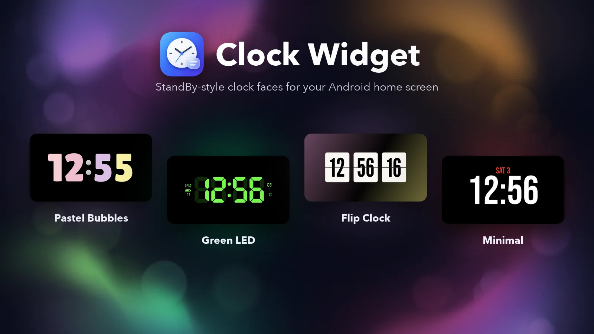
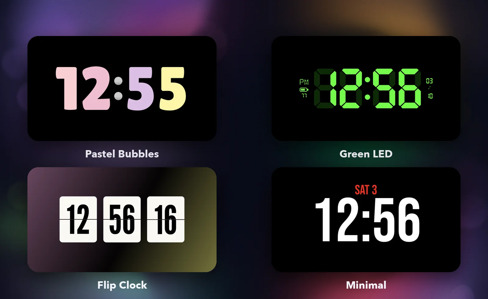
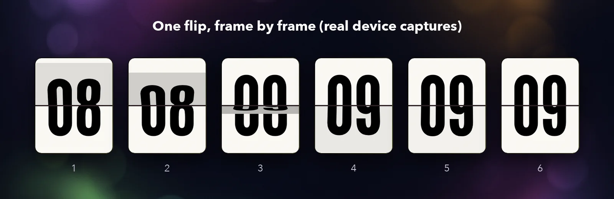
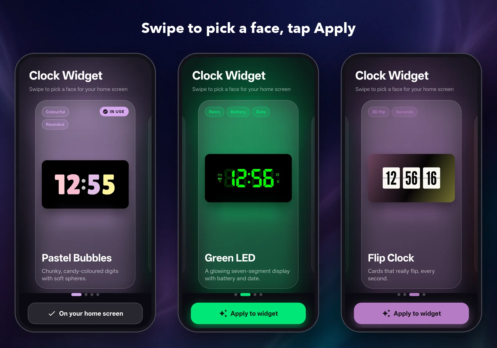
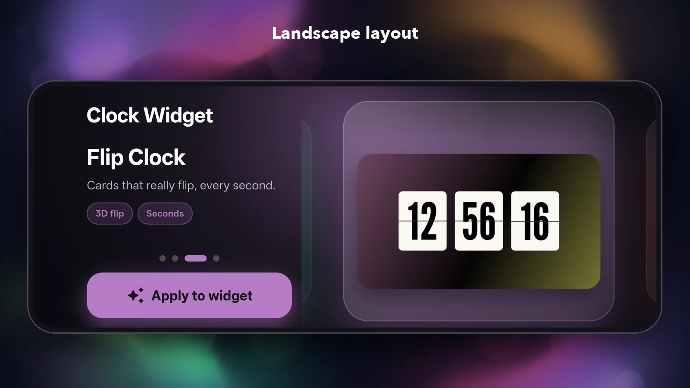

<p align="center">
  
</p>

# Clock Widget

StandBy-style clock faces as a real **Android home-screen widget**. Pick one of four faces
in the app, drop the widget on your home screen, done.

The faces are modelled on the clock screens of the *StandBy Mode: Clock & Widgets* app. That app
draws them in a screensaver (`DreamService`), not in a widget, so everything here was rebuilt
from measurements of its screenshots, not copied from it.

Flutter is only the **theme picker**. The widget itself is plain Android
(`ClockWidgetProvider` + RemoteViews + a little Canvas drawing).

## The faces

<p align="center">
  
</p>

| Face | What it is | How it is drawn |
|---|---|---|
| **Pastel Bubbles** | Chunky Lilita One digits, one pastel colour per digit, two grey spheres as the colon | Vector digits tinted per slot |
| **Green LED** | Seven-segment display with dim "ghost" segments, AM/PM, battery level and date | Vector segments + seven-segment glyph vectors |
| **Flip Clock** | Three cards (hh · mm · ss) that really flip, every second | Bitmaps drawn with `Canvas` + `Camera`, streamed as frames |
| **Minimal** | A big white time with a red date | One bitmap in Bebas Neue |

### The flip

RemoteViews cannot animate a 3D flip, so the flip card is drawn by `FlipCardRenderer`: one flap
hinged on the centre seam. Its front is the old top half, its back is the new bottom half, and it
turns through 180° with perspective and shading. About 15 frames are streamed into the widget over
450 ms. The minute and hour cards flip in the same instant as the seconds when they change.

<p align="center">
  
</p>

*Captured frame by frame from a real device.*

## The theme picker

A full-screen carousel with a live-coloured backdrop and screenshots of the real widget. The
selected face is marked **IN USE**, and **Apply to widget** switches the widget immediately.

<p align="center">
  
</p>

It has its own landscape layout too:

<p align="center">
  
</p>

## Using it

1. Install the app and open it.
2. Long-press the home screen → **Widgets** → **Clock Widget**, and place it.
3. Open the app again, swipe to a face and tap **Apply to widget**.

## Build

```bash
flutter pub get
flutter run                       # or: flutter build apk --debug
```

`flutter analyze` and `flutter test` should both pass. The widget code lives under
`android/app/src/main/`.

## How it works

### Fonts do not work inside widgets

On the test phone (OnePlus/Oppo, ColorOS launcher) a font set on a widget `TextView`, whether through
a style or `android:fontFamily` directly, is silently ignored and the text falls back to the system
font. So no face puts a styled font on a widget view:

- **Pastel and LED** use vector drawables generated from the real glyph outlines by
  [`tools/gen_glyphs.py`](tools/gen_glyphs.py). The provider picks the glyph with `setImageLevel`,
  and the per-digit colours are just `android:tint`.
- **Flip and Minimal** are bitmaps drawn in the app process, where bundled fonts *do* load.

### Staying on time

A widget has no tick of its own. An `AlarmManager` alarm is not good enough either: on the test
phone the battery manager freezes the background process and the broadcast reached it **8–10
seconds late**. So `ClockTickService`, a foreground service, keeps the process alive and wakes on
the boundary: every second for Flip, every minute for the other faces. Minute updates now land
within about 40 ms of `hh:mm:00`.

It is a normal foreground service, so Android shows a (lowest-priority) notification while a widget
exists, and it only runs while the screen is on.

### Rebuilding the look from screenshots

The designs were reconstructed from three reference screenshots:

- **Fonts** were identified by comparing glyph masks (IoU) and aspect ratios against every font in
  the reference app. Pastel is **Lilita One** (IoU 0.93), Flip is **League Gothic** (IoU 0.96),
  Minimal uses **Bebas Neue**. The LED digits are *not* a font at all: they are custom hexagonal
  segments, so their outlines were extracted from the screenshot with contour approximation and
  redrawn as vectors.
- **Colours**: the four pastel digit colours are Material Design 100-level swatches
  (`#FFCDD2`, `#F8BBD0`, `#E1BEE7`, `#FFF59D`).
- **Geometry** (digit height, colon spacing, card size, gaps) was measured in pixels and converted
  to dp.

## Limitations

- Developed and tested on one phone (CPH2651, Android 16). Other launchers are unverified.
- Starting a foreground service needs the app in the foreground (Android 12+). After a reboot the
  widget falls back to a once-a-minute alarm, with flipping minutes, until you open the app and apply
  a face again.
- Flip animates every second, which costs some battery and CPU (about 9 % app and 20 % launcher on
  the test phone, while the screen is on).
- The pastel digits have no soft white glow around them, unlike the original.
- The faces are laid out for a widget about 215–225 dp wide.

## Project layout

```
lib/main.dart                      theme picker (Flutter)
assets/previews/                   widget screenshots shown in the picker (WebP)
android/app/src/main/
  kotlin/.../ClockWidgetProvider   builds the RemoteViews for the selected face
  kotlin/.../ClockTickService      ticks the widget on time
  kotlin/.../FlipCardRenderer      draws a flip card and its 3D flip
  kotlin/.../MinimalRenderer       draws the minimal face
  res/layout/widget_theme_*.xml    one layout per face
  res/drawable/                    generated glyph vectors (pastel_*, seg_*, led_d*)
tools/gen_glyphs.py                glyph outlines -> vector drawables (needs fonttools)
docs/images/                       images used by this README (WebP)
```

Run `python3 tools/gen_glyphs.py` from the project root after changing a font or a glyph size.

## About the images

The screenshots in this README are real captures from the test phone. The backdrops behind them
were generated with an image model, and the composition was done with a script. Nothing in the
screenshots is mocked up.

## Credits and licences

- Inspired by **StandBy Mode: Clock & Widgets** (`br.com.zetabit.ios_standby`). This project is
  independent and not affiliated with it. No code was reused, only measurements of how it looks.
- Fonts: **Lilita One**, **League Gothic** and **Bebas Neue** are open fonts under the SIL OFL.
  The seven-segment font (`segments.otf`, "7 Seg Classic") was taken from the reference app's
  resources and **its licence has not been verified**; check it before redistributing this project.
